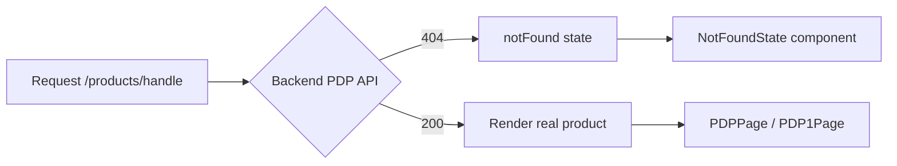

# Discuss ActionPlan — 2026-07-06 (สัปดาห์ 30 มิ.ย.–6 ก.ค. 2569)

## งานที่ทำเสร็จสัปดาห์นี้

- **DAPP Trade-in** — เชื่อม API CompAsia จริงเข้า Trade-in modal บน PDP ครบ pipeline: catalog hierarchy (category→brand→model→variant), diagnostics quiz, ราคาประเมิน, บันทึกลง cart/order ให้ admin ตรวจสอบได้ผ่าน Filament
- **PDP/Pages 404 fix** — แก้ bug ที่ PDP ไม่มีสินค้าจริง หรือ `/pages/{slug}` ไม่มีจริง กลับไปโชว์สินค้าปลอม (MacBook Pro 14 mock) หรือ HomePage เงียบๆ แทนที่จะขึ้น 404 — สร้าง `NotFoundState` component กลาง ใช้ร่วมกันทุกจุด (PDPPage, PDP1Page, PDPRouter, PageContentPage, top-level App router)

## งานด่วน/งานแทรก

- **Prod outage postmortem** — เหตุ `kill -USR2 1` ผิด process ทำ uficon.com ล่มจริง สรุปสาเหตุ + wrote lesson (never blind-kill PID1 without checking init system)
- **FFD SSO fix** — แก้ dismiss button ที่ทำให้ cross-device lock หลุดโดยไม่ตั้งใจ (delete_user_meta ที่ไม่ควรลบ)
- **dev-radar GitHub Pages 404** — Pages ถูกปิดทั้งระบบใน repo settings เปิดกลับผ่าน GitHub API

## Flow: PDP 404 fix

## หมายเหตุ

Entry นี้เป็น entry แรกของระบบ Discuss ActionPlan ใหม่ — แทนที่หน้า action-plan.html แบบ static breakdown เดิม (ที่ M2Dev บอกว่าไม่ใช่สิ่งที่ต้องการ) ด้วย log รายสัปดาห์แบบนี้แทน ทุกวันจันทร์ Oracle จะถามงานที่ทำเสร็จ + งานด่วนที่แทรกเข้ามา แล้วบันทึกเป็นไฟล์ใหม่ในโฟลเดอร์นี้
