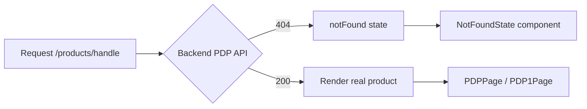

# Discuss ActionPlan — 2026-07-06 (สัปดาห์ 30 มิ.ย.–6 ก.ค. 2569)

## งานที่ทำเสร็จสัปดาห์นี้

### DAPP (iStudio — Laravel + React)

- **SEO/AEO/GEO infrastructure** — SSR content pages + dynamic rendering (bot UA detection), sitemap ครบ 226 URLs, Tag Analytics, จัดหมวด Settings menu ใหม่
- **Media Library + Media Browser** — แก้ modal ที่ position เพี้ยน (bypass Filament stacking context ด้วย vanilla JS), inline upload, auth
- **Trade-in** — เชื่อม API CompAsia จริงเข้า modal บน PDP ครบ pipeline: catalog hierarchy (category→brand→model→variant), diagnostics quiz, ราคาประเมิน, บันทึกลง cart/order ให้ admin ตรวจสอบได้ผ่าน Filament
- **PDP/Pages 404 fix** — แก้ bug ที่ PDP หรือ `/pages/{slug}` ที่ไม่มีจริง เคยกลับไปโชว์สินค้าปลอมหรือ HomePage เงียบๆ แทนที่จะขึ้น 404 — สร้าง `NotFoundState` component กลาง ใช้ร่วมทุกจุด
- **CKEditor CSS-loss fix** — แก้ `<style>` block หายตอน save (ย้ายไปใช้ custom_css field แยก) + แก้ CSS selector กว้างเกินไป 6 จุดบน FE
- **Form Builder + Graper** — แก้ shortcode `[form id=X]` ไม่ขึ้นบน Preview route, แก้ duplicate nav บน Graper editor
- **AppleCare PDP** — แก้ data/null-gate issues
- **CI/CD** — อัปเดต action versions, PostgreSQL test fix, Swarm scaffold

### Bolttech Service

- **Contract UFicon system + Contracts UI** — ระบบ contract ใหม่ + หน้า UI จัดการ
- **Mock/pending fix** — แก้ contract ค้าง pending (mock path ไม่เรียก `updateContractResult` — เพิ่มให้ mirror ทาง real path)
- **Basic Auth middleware** — ครอบ `/logs-ui`, `/contracts-ui`, `/settings`, `/docs`, `/mock`, `/logs`

### FFD Portal (education.uficon.com)

- **SSO session-lock fix** — แก้ school/ref lock หลุดตอน revisit หลัง SSO login

### KBank Webhook

- **Race condition fix deploy** — webhook ส่งซ้ำ (success + failed) ทำ order flip กลับ awaiting-payment — deploy idempotency guard ครบทุก handler (SmartPay, QR, cron/manual sync) บน education prod

### Dev Radar (repo นี้)

- แก้ GitHub Pages 404 (Pages ถูกปิดในระบบ เปิดกลับผ่าน API)
- สร้างระบบ Discuss ActionPlan ทั้งหมด (log รายสัปดาห์ + in-site markdown/Mermaid viewer)

## งานด่วน/งานแทรก

- **FFD dismiss lock hotfix** — เจอ bug เดียวกันซ้ำ (dismiss button ลบ `user_meta` ที่ไม่ควรลบ ทำ cross-device lock หลุด) แก้ + deploy สดวันเดียวกัน
- **Production stability hardening** — ปรับ procedure reload PHP-FPM ให้ target ด้วยชื่อ process แทนการอ้าง PID ตรงๆ ป้องกัน edge case บน container ที่ init system ต่างกัน
- **Bolttech auth/mock pending** — แก้ต่อเนื่องจากงานหลัก (record ค้างจาก pre-deploy + auth gap)

## Flow: PDP 404 fix

## หมายเหตุ

Entry นี้เป็น entry แรกของระบบ Discuss ActionPlan ใหม่ — แทนที่หน้า action-plan.html แบบ static breakdown เดิม (ที่ M2Dev บอกว่าไม่ใช่สิ่งที่ต้องการ) ด้วย log รายสัปดาห์แบบนี้แทน ทุกวันจันทร์ Oracle จะถามงานที่ทำเสร็จ + งานด่วนที่แทรกเข้ามา แล้วบันทึกเป็นไฟล์ใหม่ในโฟลเดอร์นี้

รายการนี้ดึงจาก retrospective ทุก session ในสัปดาห์นี้ (ψ/memory/retrospectives) ไม่ใช่แค่ที่คุยในเซสชันปัจจุบัน — เพื่อให้ log ครบทุกงานจริง
